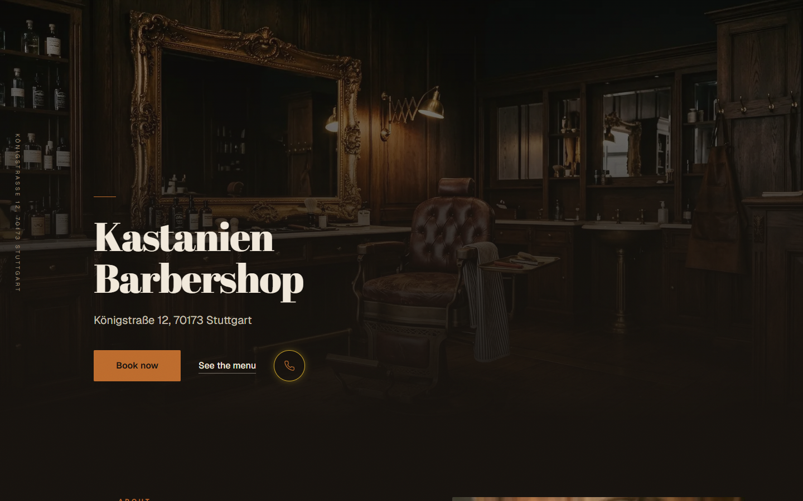
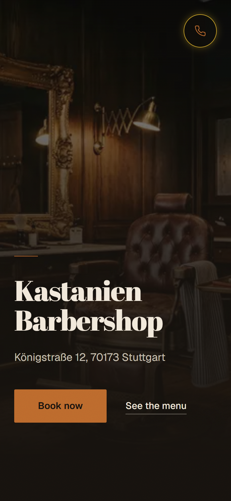
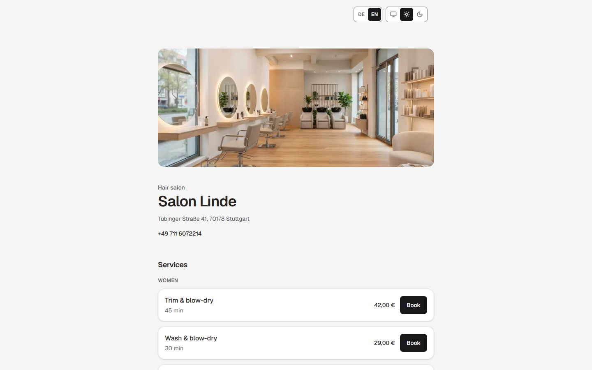
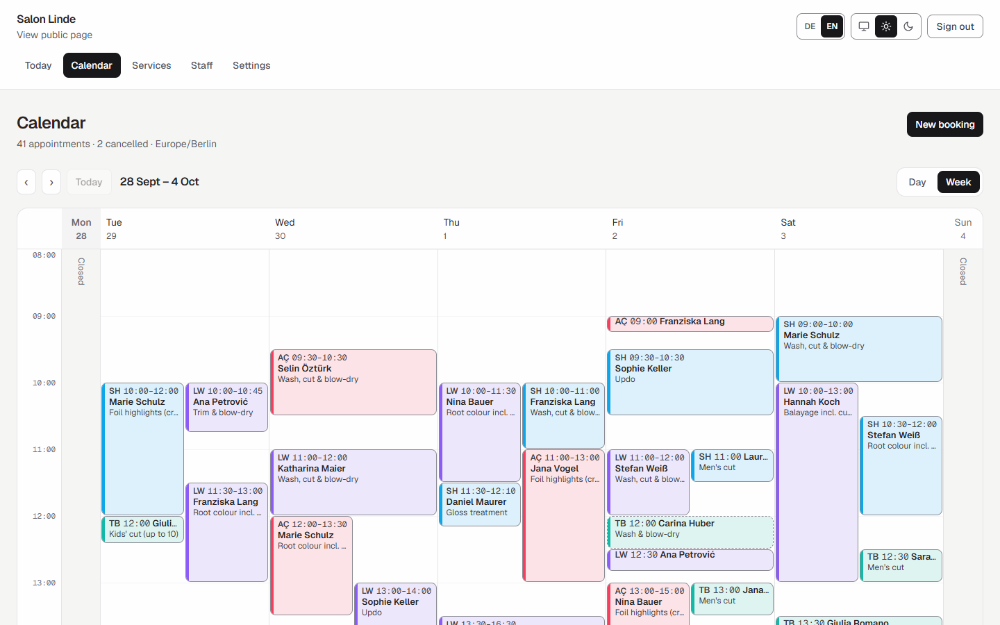
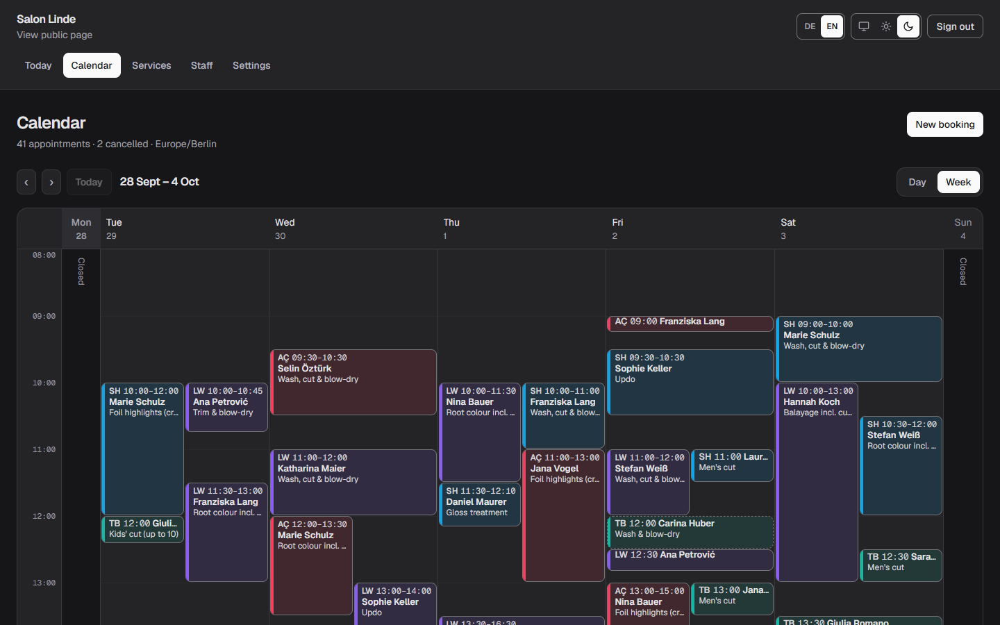

# Bookilo

Online booking for barbershops and hair salons: a public booking page for each shop, and a calendar dashboard for its owner.

Bookilo is a multi-tenant booking system. Each shop is a tenant with its own staff, services, working hours and customers, and every shop runs on the same codebase and database. Customers book from the shop's public page without creating an account, and cancel from a link in their confirmation email. It's built for small independent shops in Germany, and the interface is in English with a German toggle. It's a solo portfolio project, and both demo shops and all their data are fictional.

## Live demo

| | |
|---|---|
| Kastanien Barbershop, booking page | [bookilo-saas.vercel.app/b/kastanien-barbershop](https://bookilo-saas.vercel.app/b/kastanien-barbershop) |
| Kastanien Barbershop, marketing site | [bookilo-saas.vercel.app/shop/kastanien-barbershop](https://bookilo-saas.vercel.app/shop/kastanien-barbershop) |
| Salon Linde, booking page | [bookilo-saas.vercel.app/b/salon-linde](https://bookilo-saas.vercel.app/b/salon-linde) |
| Owner dashboard | [bookilo-saas.vercel.app/login](https://bookilo-saas.vercel.app/login) |

**Demo owner login (Salon Linde):** `salon-owner@demo.test` / `demo-password-123`.
This is a shared demo account with fictional data, so other visitors may have added or changed bookings.

The shop photos in both demos are AI-generated.

## Two ways a shop can use it

Both tiers run on the same booking engine and dashboard. They differ only in the shop's front page.

<table>
<tr>
<td width="38%" valign="top">

**Custom marketing site + booking**
*Kastanien Barbershop*

A bespoke one-page site with its own typography and palette, at `/shop/kastanien-barbershop`. Prices, durations, hours and address are read live from the shop's own data, so an edit in the dashboard shows up here immediately. "Book now" leads into the standard booking flow.

</td>
<td valign="top">


</td>
</tr>
<tr>
<td valign="top">

**Standard booking page**
*Salon Linde*

The shared template every shop gets at `/b/{slug}`, with an optional hero photo. It needs no design work: the shop's services, staff and hours are the whole setup.

</td>
<td valign="top">

</td>
</tr>
</table>

## Features

- **Online booking.** Customers pick a service, a staff member (or anyone available) and a live open slot, with no account needed. Buffer time, minimum lead time and a cancellation window are set per shop.
- **Owner dashboard.** Day and week calendar with staff columns, a today overview, walk-in booking entry, services and staff management (working hours, time off), and settings.
- **Cancellation by email link.** The confirmation email carries a cancel link backed by an unguessable token.
- **English and German.** English is the default. Service names are stored in German and can carry an English version that follows the toggle.
- **Light and dark themes**, plus a "follow the system" option.
- **Barbershops and salons from one codebase.** The shop's type switches the wording ("barber" vs. "stylist") and nothing else.

<p>


</p>

## Tech stack

- **Next.js 16.2** (App Router, Server Actions, no separate API layer), **React 19.2**, **TypeScript 5** in strict mode
- **PostgreSQL** on Neon, via **Prisma 6.19**
- **Auth.js v5** (`next-auth` 5.0.0-beta.32), credentials login, JWT sessions, bcryptjs
- **Tailwind CSS 4**
- **Zod 4** for input validation, **Luxon 3.7** for all date and time handling
- **Resend** for transactional email
- **Vitest 4**, ESLint 9
- Deployed on **Vercel**

## Interesting engineering decisions

**The database prevents double-booking, not just the UI.** A Postgres exclusion constraint on `Booking` rejects two overlapping appointments for the same staff member, even when both requests arrive at the same moment. The range covers the booking plus its cleanup buffer, and it counts `COMPLETED` as well as `CONFIRMED` bookings, so completing an appointment doesn't reopen its slot. A violation is mapped to a "someone got there first" message. A probe script tests both directions: concurrent bookings for the same slot produce exactly one success, and back-to-back bookings (10:00–10:30, then 10:30–11:00) both succeed. It has been re-run against production over Neon's pooled connection.

**Tenant isolation is enforced by structure, not by care.** Every query on tenant-owned data goes through `lib/db/*` helpers that take `tenantId` as a required parameter and build it into the `where` clause, and an ESLint rule bans importing the Prisma client anywhere else. Public pages identify the shop from the URL, and dashboard actions identify it only from the server-side session, never from form input. A foreign key only proves a row exists somewhere, so creating a booking re-fetches its staff, service and customer scoped to the tenant first. Probe scripts assert that one tenant can't modify another's data, and that a valid cancel token fails when used under another shop's URL.

**A security audit before launch, and what it changed.** The audit found no cross-tenant path, but it did change three behaviours. The public booking form could previously overwrite a returning customer's name and email just by reusing their phone number, and now it only links the booking to the existing record. Sessions now re-check the user row on every request, so a deleted user, or a non-owner role, loses dashboard access at once instead of when the 30-day token expires. Hard-deleting staff or services is now blocked inside the Prisma client, not just by convention. One known gap is still open: resetting a password doesn't end existing sessions, because fixing that needs a schema change.

**Salon wording is whole sentences, not a swapped noun.** German can't take "stylist" spliced into a sentence written for "barber", because articles and case endings change with it. Each vertical therefore overrides complete messages on top of the base dictionary. A test fails if any message rendered for a salon still mentions a barber or a barbershop, or if an override drops a placeholder.

**Theme and language load without a flash.** Both preferences are cookies that the root layout reads on the server, so the very first byte of HTML already carries the right `lang` and `data-theme`, with no inline script. One CSS `color-scheme` property drives every colour token (via `light-dark()`) and the browser's own controls, such as scrollbars and date pickers, so the two can't disagree. Tests check the palette's contrast in both themes.

## Running locally

Requirements: Node.js 20+ and a Postgres database (the project uses Neon).

```
npm install
```

Copy `.env.example` to `.env`:

| Variable | Purpose |
|---|---|
| `DATABASE_URL` | Pooled connection the app uses at runtime |
| `DIRECT_URL` | Direct (non-pooled) connection for Prisma migrations |
| `AUTH_SECRET` | Auth.js secret (`openssl rand -base64 32`) |
| `RESEND_API_KEY`, `EMAIL_FROM` | Leave both blank locally: emails are logged instead of sent |
| `APP_URL` | Base URL for cancel links in emails (default `http://localhost:3000`) |
| `SEED_*` | Demo owner logins for the seed scripts (defaults in `.env.example`) |

```
npx prisma migrate dev
npm run db:seed
npm run db:seed:salon
npm run dev
```

The seeds create both demo shops, with appointments spread over one week either side of today (7 days back, 7 forward). Open `http://localhost:3000/b/salon-linde`, or sign in at `/login`.

Use `prisma migrate`, never `prisma db push`. The double-booking constraint is hand-written SQL that Prisma's schema language can't express, so `db push` would silently drop it.

### Checks

```
npm run typecheck
npm run lint
npm test
npm run probe:constraint
```

`typecheck` runs on its own because Vitest strips types without checking them. The `probe:*` scripts run against a real database. `probe:crud` and `probe:constraint` each create their own throwaway tenants and delete them before and after the run.

## Known limitations and roadmap

- **No payments or deposits.** Bookings are free to make and free to cancel.
- **No SMS or WhatsApp reminders.** Notifications are email only.
- **No staff login yet.** Only the owner has an account. The data model already has a `STAFF` role for it.
- **Colour processing time isn't modelled.** A salon can't book a stylist's second client while a colour develops, so a colour service blocks its stylist for the whole duration.
